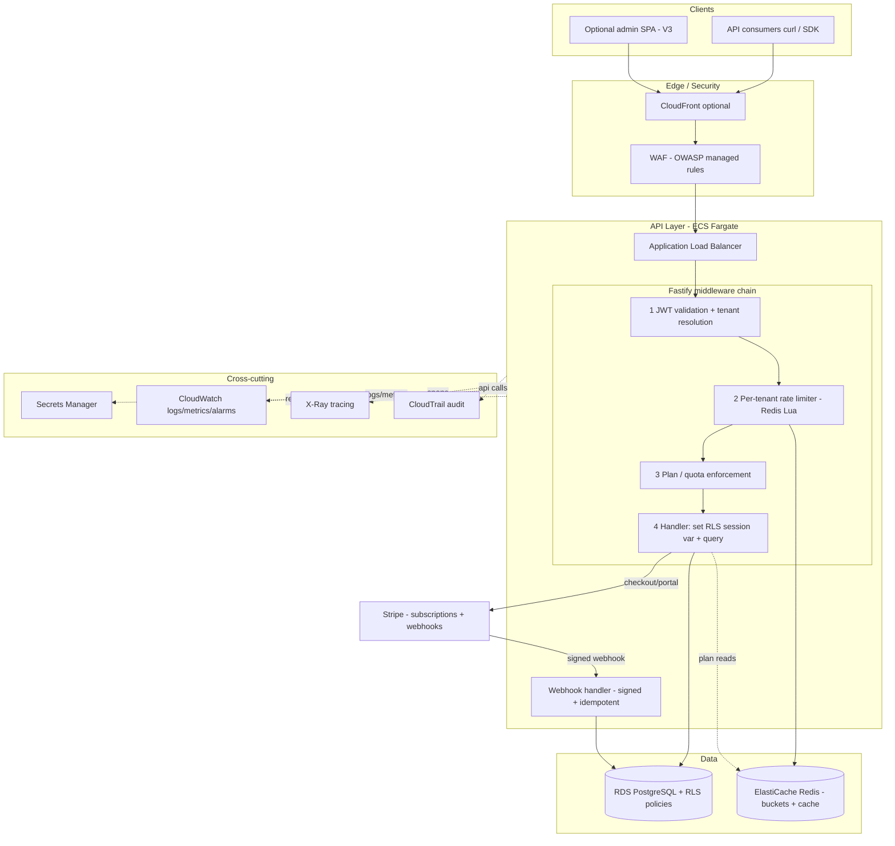
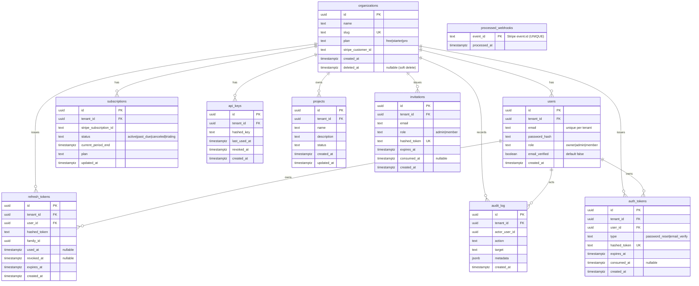
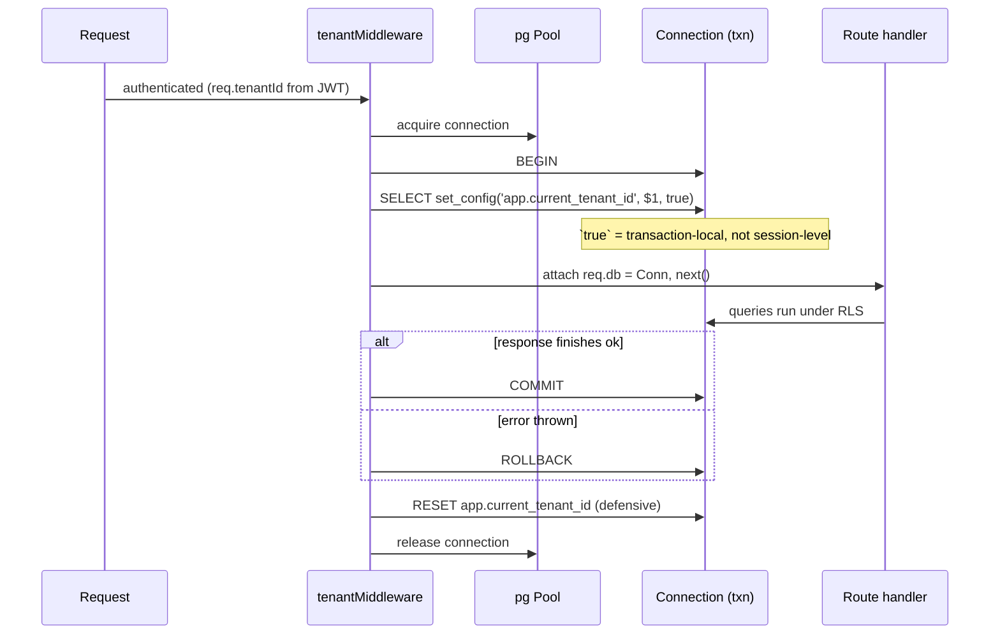
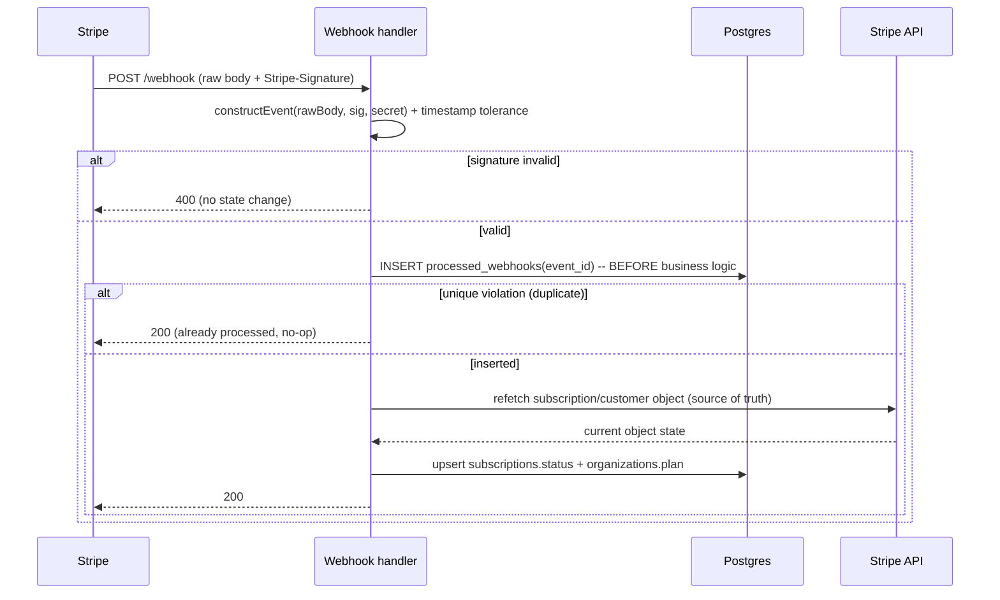
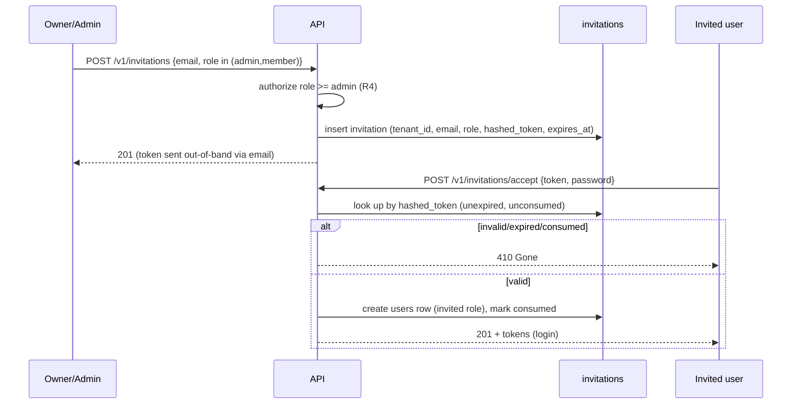

# TenantForge — Design

> **Spec:** `tenantforge`
> **Status:** Draft (v1)
> **Related:** [`requirements.md`](./requirements.md) · [`tasks.md`](./tasks.md)

## 1. Overview

TenantForge is a stateless TypeScript API (Fastify) on ECS Fargate, backed by PostgreSQL (RDS)
with Row-Level Security for tenant isolation and Redis (ElastiCache) for rate limiting and hot
caching. Billing is delegated to Stripe with a signed, idempotent webhook handler. All
infrastructure is Terraform; delivery is GitHub Actions with migrations run in-pipeline.

### Technology decisions

| Concern | Choice | Rationale (→ requirement) |
|---|---|---|
| Language / framework | TypeScript + **Fastify** | Fast, schema-first; matches portfolio TS stack (R8, R14) |
| Validation / contracts | **Zod** via `fastify-type-provider-zod` | Single source of truth → OpenAPI 3.1 (R14) |
| DB access | **Drizzle ORM** (+ raw session vars) | SQL-like, zero-runtime; plays cleanly with RLS `set_config` (R6) |
| Primary DB | **PostgreSQL** on RDS | RLS is the isolation mechanism (R6, R7) |
| Cache / limiter | **Redis** on ElastiCache | Shared atomic token bucket across tasks (R12) |
| Auth | Custom **JWT access + rotating refresh** | Demonstrates mechanics; Cognito noted as the "at scale" option (R3, R4) |
| Billing | **Stripe** Subscriptions + Portal + Webhooks | Industry standard; idempotency is the signal (R9–R11) |
| Compute | **ECS Fargate** | Stateless horizontal scale, no server mgmt (NFR2) |
| IaC | **Terraform** (remote state S3 + DynamoDB) | Reproducible, reviewable (R17) |
| CI/CD | **GitHub Actions** | Lint→test→build→ECR→apply→migrate→deploy→smoke (R18) |
| Edge | **WAF** (OWASP) + ALB + optional CloudFront | OWASP Top 10 protection (R19) |
| Observability | CloudWatch + X-Ray + CloudTrail | Logs/metrics/alarms/tracing/audit (R15, R16, R19) |

---

## 2. System Architecture



### Request lifecycle (happy path)

```mermaid
sequenceDiagram
    participant Client
    participant ALB
    participant Auth as JWT+Tenant MW
    participant RL as RateLimiter MW
    participant Plan as Plan MW
    participant H as Handler
    participant PG as Postgres (RLS)

    Client->>ALB: GET /v1/projects (Bearer access token)
    ALB->>Auth: forward
    Auth->>Auth: verify JWT, extract tenant_id + role
    Auth->>RL: continue (req.tenantId set)
    RL->>RL: Redis Lua: refill+decrement bucket(tenant)
    alt bucket empty
        RL-->>Client: 429 + Retry-After
    else allowed
        RL->>Plan: continue (+RateLimit headers)
        Plan->>Plan: check subscription status/plan
        Plan->>H: continue
        H->>PG: BEGIN; set_config('app.current_tenant_id', tenant, true)
        H->>PG: SELECT ... FROM projects  (RLS filters by tenant)
        PG-->>H: only this tenant's rows
        H->>PG: COMMIT (context discarded)
        H-->>Client: 200 + body + request_id
    end
```

---

## 3. Data Model

All tenant-scoped primary keys are **UUID** (non-enumerable, R8.3). `tenant_id` is the **leftmost
column of every composite index** on tenant-scoped tables (NFR2.2). `organizations.id` is the
single source of truth every `tenant_id` references (R6.1).

### 3.1 Entity-relationship diagram



### 3.2 Table specifications

| Table | Tenant-scoped? | Key columns / constraints | Indexes |
|---|---|---|---|
| `organizations` | Root (global) | `id` uuid pk; `slug` unique; `plan` not null default `free`; `deleted_at` nullable | `uniq(slug)` |
| `users` | Yes | `tenant_id` fk not null; `unique(tenant_id, email)`; `role` not null | `idx(tenant_id, email)` |
| `subscriptions` | Yes | `tenant_id` fk not null; `stripe_subscription_id` unique; `status` not null | `idx(tenant_id, status)` |
| `api_keys` | Yes | `tenant_id` fk not null; `hashed_key` unique; `revoked_at` nullable | `idx(tenant_id, revoked_at)`, `uniq(hashed_key)` |
| `refresh_tokens` | Yes | `tenant_id`, `user_id` fk not null; `hashed_token` unique; `family_id` not null | `idx(tenant_id, family_id)`, `uniq(hashed_token)` |
| `projects` | Yes (**RLS enforced**) | `tenant_id` fk not null; uuid pk | `idx(tenant_id, created_at)` |
| `audit_log` | Yes | `tenant_id` fk not null; `metadata` jsonb | `idx(tenant_id, created_at)` |
| `invitations` | Yes | `tenant_id` fk not null; `hashed_token` unique; `email`, `role`, `expires_at`, `consumed_at` nullable | `idx(tenant_id, email)`, `uniq(hashed_token)` |
| `auth_tokens` | Yes | `tenant_id`, `user_id` fk not null; `type` (`password_reset`\|`email_verify`); `hashed_token` unique; `expires_at`, `consumed_at` nullable | `idx(tenant_id, user_id, type)`, `uniq(hashed_token)` |
| `processed_webhooks` | Global (billing infra) | `event_id` text pk (UNIQUE) | pk |

> **New in v1.1:** `invitations` (R20) and `auth_tokens` (R22, password-reset + email-verify) are
> tenant-scoped and carry RLS policies. `users` gains an `email_verified boolean not null default false`
> column (R22.6). Token columns store **hashes only**, never plaintext (R22.2, R22.7).

> **Global vs tenant-scoped registry:** `organizations` and `processed_webhooks` are **global**
> (no `tenant_id` RLS policy). Everything else — `users`, `subscriptions`, `api_keys`,
> `refresh_tokens`, `projects`, `audit_log`, `invitations`, `auth_tokens` — is **tenant-scoped**
> and carries an RLS policy. This explicit list is consumed by the ORM guard, the migration linter,
> the GDPR **data-export job (R24)**, and the tenant-purge job (see §8 Edge Cases). Any new table
> absent from both lists **fails CI**.

### 3.3 Drizzle schema conventions

- One file per domain under `db/schema/` (`organizations.ts`, `users.ts`, `projects.ts`, …), re-exported from `db/schema/index.ts`.
- UUID PKs: `uuid("id").defaultRandom().primaryKey()`.
- Every tenant-scoped table: `tenant_id: uuid("tenant_id").notNull().references(() => organizations.id)`.
- Composite indexes always lead with `tenant_id`: `index("projects_tenant_created_idx").on(t.tenantId, t.createdAt)`.
- Types inferred via `InferSelectModel` / `InferInsertModel` — no hand-written interfaces.
- Migrations generated with `drizzle-kit generate`, applied with `drizzle-kit migrate` (never `push` outside local dev).

```typescript
// db/schema/projects.ts
import { pgTable, uuid, text, timestamp, index } from "drizzle-orm/pg-core";
import { organizations } from "./organizations";

export const projects = pgTable(
  "projects",
  {
    id: uuid("id").defaultRandom().primaryKey(),
    tenantId: uuid("tenant_id").notNull().references(() => organizations.id),
    name: text("name").notNull(),
    description: text("description"),
    status: text("status").notNull().default("active"),
    createdAt: timestamp("created_at", { withTimezone: true }).defaultNow().notNull(),
    updatedAt: timestamp("updated_at", { withTimezone: true }).defaultNow().notNull(),
  },
  (t) => [index("projects_tenant_created_idx").on(t.tenantId, t.createdAt)]
);
```

---

## 4. Row-Level Security: policy template & role setup

RLS is the heart of the project (R6). It is applied to **every** tenant-scoped table and enforced
by database roles that cannot bypass it.

### 4.1 Role setup

```sql
-- Migration/owner role: owns tables, may alter schema and policies.
-- Used ONLY by the migration pipeline (R18.2), never by the app.
CREATE ROLE tenantforge_migrator LOGIN PASSWORD '<from-secrets-manager>';

-- Application role: connects for all runtime traffic.
-- Critically: NOT a superuser, does NOT have BYPASSRLS (R6.3, NFR1.3).
CREATE ROLE tenantforge_app LOGIN PASSWORD '<from-secrets-manager>' NOSUPERUSER NOBYPASSRLS;

GRANT SELECT, INSERT, UPDATE, DELETE ON ALL TABLES IN SCHEMA public TO tenantforge_app;
ALTER DEFAULT PRIVILEGES IN SCHEMA public
  GRANT SELECT, INSERT, UPDATE, DELETE ON TABLES TO tenantforge_app;
```

### 4.2 Policy template (applied to every tenant-scoped table)

```sql
-- Example: projects. Repeat for users, subscriptions, api_keys,
-- refresh_tokens, audit_log.
ALTER TABLE projects ENABLE ROW LEVEL SECURITY;
ALTER TABLE projects FORCE ROW LEVEL SECURITY;   -- (R6.2) applies even to table owner

CREATE POLICY tenant_isolation_select ON projects
  FOR SELECT
  USING (tenant_id = current_setting('app.current_tenant_id')::uuid);

CREATE POLICY tenant_isolation_mod ON projects
  FOR ALL
  USING (tenant_id = current_setting('app.current_tenant_id')::uuid)
  WITH CHECK (tenant_id = current_setting('app.current_tenant_id')::uuid);
```

- `USING` filters reads/updates/deletes; `WITH CHECK` blocks writing another tenant's `tenant_id` (R6.7).
- `current_setting('app.current_tenant_id')` is set **transaction-locally** per request (§5).
- If the setting is missing, `current_setting(...)::uuid` errors → request **fails closed** (R6.8). A `current_setting('app.current_tenant_id', true)` variant returns NULL to force zero rows instead of erroring, chosen per-policy based on desired failure mode.

### 4.3 Migrations and RLS

Migrations run as `tenantforge_migrator` (R18.2, and per the `saas-multi-tenant` skill's "never run
migrations with RLS enabled on the app connection"). The app role is used exclusively for runtime
queries so RLS is always in force for tenant traffic.

---

*(Design continues in §5–§10 below: subsystem designs, versioning, contracts, and ADRs.)*

---

## 5. Subsystem A — Tenant-context middleware (RLS binding)

Realizes R6.4, R6.5, R6.8, R6.9. This is the seam that connects an authenticated request to the
database's tenant filter.

### 5.1 Flow



### 5.2 Rules (from the `saas-multi-tenant` skill)

- Use `set_config('app.current_tenant_id', $1, true)` — the trailing `true` makes it **transaction-local**. `SET LOCAL` cannot take bind placeholders, so `set_config` is the parameter-safe form.
- **Never** use session-level `SET` behind a pool: a leftover setting bleeds into the next request that reuses the connection (R6.9).
- Guarantee release + reset in the cleanup path even if the handler throws or skips `next()` (wrap in `try/finally`; also `res.on("finish")`).
- The app role has no `BYPASSRLS`, so the policy is unconditional — a forgotten `WHERE` or a raw SQL query still cannot cross tenants (R6.6).
- Background jobs (no HTTP request) must set the same context from the job payload's `tenant_id` before touching tenant tables.
- **API-key requests bind identically (R5.6):** after resolving `tenant_id` from the presented key, the same `set_config('app.current_tenant_id', tenantId, true)` runs, so key-based traffic is under the same RLS isolation as JWT traffic.
- **Refresh-token lookup under RLS (bootstrapping note, R3.3):** the `refresh_tokens` table is tenant-scoped, but the refresh exchange happens before a tenant context is established from a token. Resolve this by encoding the `tenant_id` in the refresh-token record's lookup path — the client presents an opaque token whose server-side record carries `tenant_id`; the handler looks it up via a **narrow, dedicated query path** (either the migrator/bypass role restricted to `refresh_tokens` by lookup hash, or a `SECURITY DEFINER` function that returns only the matching row), then sets the tenant context for the remainder of the request. The lookup is by `hashed_token` (unique), so it cannot enumerate other tenants' tokens.

```typescript
// src/middleware/tenant.ts (Fastify preHandler)
export async function withTenant(req, reply) {
  const tenantId = req.auth?.tenantId;              // set by auth (Subsystem D)
  if (!tenantId) return reply.code(403).send({ code: "NO_TENANT_CONTEXT" });

  const client = await pool.connect();
  await client.query("BEGIN");
  // parameter-safe, transaction-local tenant binding
  await client.query("SELECT set_config('app.current_tenant_id', $1, true)", [tenantId]);
  req.db = client;

  reply.raw.on("finish", async () => {
    try { await client.query("COMMIT"); }
    catch { await client.query("ROLLBACK").catch(() => {}); }
    finally {
      await client.query("RESET app.current_tenant_id").catch(() => {}); // defensive
      client.release();
    }
  });
}
```

---

## 6. Subsystem B — Per-tenant rate limiter (atomic Redis token bucket)

Realizes R12. A single Lua script performs refill + check + decrement atomically so limits hold
across all Fargate tasks (no per-instance over-count, R12.5).

### 6.1 Lua script contract

```
KEYS[1] = ratelimit:{tenant_id}         -- Redis hash storing {tokens, ts}
ARGV[1] = capacity     (bucket size, from plan)
ARGV[2] = refill_rate  (tokens per second, from plan)
ARGV[3] = now_ms       (server clock, ms)
ARGV[4] = requested    (usually 1)

RETURNS { allowed (0|1), remaining (int), retry_after_ms (int) }
```

Logic: read `{tokens, ts}` (default full bucket) → add `((now-ts)/1000)*refill_rate` capped at
`capacity` → if `tokens >= requested`, subtract and return `{1, floor(tokens), 0}` → else return
`{0, floor(tokens), ceil((requested-tokens)/refill_rate*1000)}`. Persist `{tokens, ts=now}` with a
TTL of a few bucket-refill windows so idle tenants expire.

### 6.2 Header & response behavior

| Outcome | Status | Headers |
|---|---|---|
| Allowed | (continue) | `X-RateLimit-Limit`, `X-RateLimit-Remaining`, `X-RateLimit-Reset` |
| Denied | `429` | above + `Retry-After` (seconds) |

Plan → bucket mapping: `free` = capacity 60 / refill 1/s; `starter` = capacity 300 / refill 5/s;
`pro` = capacity 1000 / refill ~16.7/s. Configurable per plan without redeploy (R11.2).

### 6.3 Pre-authentication / IP-based limiting (R23)

Unauthenticated routes have no `tenant_id`, so they are limited by **client IP** (derived from the
trusted ALB/CloudFront proxy header, never a raw client header):

| Route class | Key | Limit (illustrative) |
|---|---|---|
| Credential (login, password-reset request) | IP | strict (e.g. 10/min) — blunts brute force |
| Other unauthenticated (signup, invite accept) | IP | moderate (e.g. 30/min) |
| Authenticated tenant traffic | `tenant_id` | plan tier (§6.2) |
| **Stripe `/webhook`** | — | **exempt** (no tenant; protected by signature R10.1) — flood protection, if any, lives at the WAF edge |

The same atomic Lua script backs IP limiting (key = `ratelimit:ip:{ip}:{routeclass}`).

### 6.4 Fail policy (R12.6) & degraded state

| Route type | Redis unavailable |
|---|---|
| Mutating / auth-adjacent | **fail-closed** → `503` |
| Idempotent read (`GET`) | **fail-open** → allow |

In both cases emit a `ratelimiter_degraded` metric. `429` responses carry `Retry-After` and the
`X-RateLimit-*` headers (§6.2).

### 6.5 Quotas vs rate limits (R21)

Rate limits (this section) are per-window request ceilings. **Quotas** are resource caps enforced in
the handler/plan layer: active `projects` ≤ `free` 3 / `starter` 25 / `pro` unlimited; a create over
quota returns `403 QUOTA_EXCEEDED`. Optional monthly request quotas are counted per tenant per
calendar month and return `429` when exceeded, independent of the per-minute bucket.

---

## 7. Subsystem C — Stripe billing: signed + idempotent webhooks

Realizes R9, R10, R11. The impressive part is safety under redelivery and out-of-order events.

### 7.1 Webhook flow



### 7.2 Rules

- **Verify first:** `stripe.webhooks.constructEvent(rawBody, sigHeader, endpointSecret)` with a narrow timestamp tolerance; reject unsigned/forged/expired with `400` and no mutation (R10.1, R10.2). The route must receive the **raw body** (disable JSON parsing for this route).
- **Idempotency via ledger:** insert `event.id` into `processed_webhooks` (UNIQUE) **before** doing work; a duplicate-key error is the dedup signal → return `200` no-op (R10.3). Safe under Stripe redelivery.
- **Refetch, don't trust payload:** events arrive out of order; derive state by calling the Stripe API for the current object rather than applying the payload blindly (R10.4).
- **State sync + dunning:** handle `customer.subscription.updated/deleted`, `invoice.payment_succeeded/failed`; `invoice.payment_failed` → `past_due` and rely on Stripe Smart Retries; a Stripe `canceled` status downgrades the tenant to `free` entitlements (R10.5, R10.6).
- **Fast ack (R10.7):** process synchronously within a **5-second budget** and return `2xx`; if work would exceed it, record the event in `processed_webhooks` first (R10.3) then enqueue and return `200`.
- **Enforcement:** `past_due`/`canceled` tenants get the **degraded-access matrix** in R11.1 — reads allowed, writes rejected with `402 Payment Required`, billing + auth endpoints always available, rate ceiling dropped to `free`; entitlements derive from persisted state, never client input (R11).

---

## 8. Subsystem D — Auth: refresh-token rotation with reuse detection

Realizes R3, R4, R5.

### 8.1 Rotation & reuse detection

```mermaid
sequenceDiagram
    participant C as Client
    participant A as Auth service
    participant DB as refresh_tokens

    C->>A: POST /v1/auth/refresh (refresh token)
    A->>DB: look up by hash
    alt token unknown / expired
        A-->>C: 401
    else token already used or revoked
        A->>DB: revoke ENTIRE family_id
        A-->>C: 401 (theft signal)
    else valid & unused
        A->>DB: mark used_at; insert new token (same family_id)
        A-->>C: new access JWT + new refresh token
    end
```

### 8.2 Rules

- Access JWT: ≤15 min, claims `sub`, `tenant_id`, `role`, signed with a key from Secrets Manager (R3.1).
- Refresh token: random, **hashed at rest**, `family_id` per login chain (R3.2).
- Rotate on every exchange; mark old `used_at`; new token joins the same family (R3.3).
- Reuse of a used/revoked token → revoke the **whole family** and `401` (R3.4) — stolen-token defense.
- Optional **rotation-overlap** window: accept the immediately-previous token briefly to tolerate client retry races without false reuse (R3.6).
- RBAC (`owner>admin>member`) and tenant derive only from verified claims, never client input (R4.4).
- API keys: return plaintext once, store hash, resolve tenant on use, honor `revoked_at` (R5).
- Never log tokens, hashes, or keys (R3.7, NFR1).

### 8.3 Team management — invitations & role assignment (R20)



- Only `owner`/`admin` may invite or change roles (R20.1, R20.2); all writes are RLS-scoped to the acting tenant (R20.7).
- **Last-owner guard (R20.6):** any role change or removal that would leave the org with zero `owner`s is rejected `409`.
- Invitation tokens are single-use, time-limited, stored **hashed**; acceptance creates the user in the inviting tenant and writes an `audit_log` entry.

### 8.4 Credential recovery — password reset & email verification (R22)

```mermaid
sequenceDiagram
    participant U as User
    participant API
    participant DB as auth_tokens

    U->>API: POST /v1/auth/password-reset/request {email}
    API-->>U: 200 (uniform response — no account enumeration, R22.1)
    Note over API,DB: if email maps to a user, store hashed reset token + expiry
    U->>API: POST /v1/auth/password-reset/confirm {token, new_password}
    API->>DB: look up by hashed_token (unexpired, unconsumed)
    alt invalid/expired/consumed
        API-->>U: 400 (no change, R22.4)
    else valid
        API->>API: set Argon2id hash; consume token
        API->>DB: revoke ALL of user's refresh-token families (R22.3)
        API-->>U: 200
    end
```

- Reset/verification tokens are single-use, time-limited, stored **hashed only**; never logged (R22.2, R22.7).
- Successful reset (or self-service change) revokes refresh-token families to log out stale sessions (R22.3, R22.5).
- Email verification flips `users.email_verified` on confirmation; sensitive actions MAY be gated on it (R22.6).

---

## 9. API design: versioning, pagination, error contract, OpenAPI

### 9.1 Versioning (R13)

- All routes under `/v1/...`. Register versions as separate Fastify plugin trees (`routes/v1/*`, `routes/v2/*`).
- Freeze `/v1` behavior; introduce breaking changes under `/v2` (e.g. renamed/removed field, changed pagination shape). Both served concurrently (R13.3).

### 9.2 Pagination (R14.3)

- Cursor-based. List responses: `{ data: [...], next_cursor: string | null }`. Page size capped (e.g. ≤100, default 25). Cursor encodes `(created_at, id)` for stable ordering on `idx(tenant_id, created_at)`.

### 9.3 Error contract (R14.4, R14.5)

```jsonc
// Consistent envelope for every error
{
  "error": {
    "code": "RESOURCE_NOT_FOUND",   // stable, machine-readable
    "message": "Project not found",  // human-readable, no internals
    "request_id": "01J..."           // correlation id (R15.2)
  }
}
```

No stack traces, SQL, or driver errors leak to clients. A central error handler maps known error
classes → codes; unknown errors → `500` with a generic message + logged internally with the
`request_id`.

### 9.4 OpenAPI 3.1 from Zod (R14.1, R14.2)

- Zod schemas are the single source of truth for request/response validation and serialization via `fastify-type-provider-zod` (or `fastify-zod-openapi`).
- `@fastify/swagger` generates the OpenAPI 3.1 document; `@fastify/swagger-ui` serves interactive docs. The generated `openapi.json` is committed to the repo so the contract is reviewable in PRs.

---

## 10. Architecture Decision Records (summaries)

### ADR-001 — Tenant isolation model: shared DB, shared schema, RLS

**Status:** Accepted. **Context:** need provable isolation at startup scale and cost.

| Model | Pros | Cons | Chosen |
|---|---|---|---|
| Shared DB, shared schema + RLS | Cheapest, scales to many tenants, single migration | One bug *could* leak without RLS; noisy-neighbor | ✅ (RLS closes the leak risk) |
| Shared DB, schema-per-tenant | Stronger isolation, per-tenant backup | Migrations run N times; schema sprawl | ❌ |
| Database-per-tenant | Strongest isolation | Expensive, complex ops | ❌ |

**Decision:** Shared schema with `tenant_id` + **FORCE RLS** on a non-`BYPASSRLS` app role. Isolation
is enforced at the database layer and proven by the cross-tenant test suite (R6.6/R6.7). **Consequences:**
every tenant-scoped table needs a policy; migrations use a separate role; admin aggregation is a
separate authenticated path (R7).

### ADR-002 — Auth: custom JWT + rotating refresh over managed IdP

**Status:** Accepted. **Decision:** Implement custom short-lived access JWT + hashed, rotating
refresh tokens with family-based reuse detection. **Rationale:** demonstrates the mechanics that
matter in interviews; Cognito is documented as the drop-in "at scale" alternative. **Consequences:**
we own token storage, rotation, and revocation logic and must test the reuse-detection path.

### ADR-003 — Rate limiting: atomic Redis token bucket (Lua)

**Status:** Accepted. **Decision:** token bucket implemented as one atomic Redis Lua script keyed by
`tenant_id`. **Rationale:** holds correctly across horizontally scaled Fargate tasks; allows bursts
while enforcing a sustained average; sub-millisecond. **Consequences:** Redis is on the hot path; a
documented fail-open/closed policy and a degraded-state metric are required (R12.6).

### ADR-004 — Billing idempotency: insert-before-process ledger + API refetch

**Status:** Accepted. **Decision:** verify signature, insert `event.id` into a UNIQUE
`processed_webhooks` ledger before business logic, and refetch object state from the Stripe API.
**Rationale:** makes redelivery a no-op and tolerates out-of-order events. **Consequences:** a small
ledger table and an extra Stripe API read per new event; correctness over micro-latency on the
webhook path.

---

## 11. Cross-cutting concerns

- **Secrets (R17.4):** DB creds, Stripe secret + webhook signing secret, JWT signing key in Secrets Manager; injected at runtime; never in the repo or image.
- **Observability (R15):** structured JSON logs with `request_id` + `tenant_id`; X-Ray spans across the middleware chain; CloudWatch metrics for error rate, p99, 429 rate.
- **Audit (R16):** `audit_log` (RLS-scoped) for app actions; CloudTrail for infra actions.
- **Edge (R19):** WAF OWASP managed rules on ALB/CloudFront; TLS terminated at the edge; HTTP rejected.
- **Cost/teardown (NFR3):** smallest RDS/ElastiCache nodes; **avoid a managed NAT Gateway** (~$32/mo) — use VPC Gateway/Interface Endpoints (S3, ECR, Secrets Manager, CloudWatch Logs) for private-subnet egress so the ~$10–15/mo target holds; `terraform destroy` between demos, retaining repo + diagrams + committed `openapi.json` + recorded demo.
- **Data export (R24):** the tenant data-export job iterates the tenant-scoped-table registry (§3.2) under RLS, excludes secret material (password hashes, hashed tokens/keys), and emits a machine-readable archive.

---

## 12. Tracing & correlation propagation (R15.2, R15.3)

The correlation id is the spine of observability. It is generated (or accepted from an inbound
`x-request-id`) in the Fastify `onRequest` hook, used as pino's `reqId` so **every log line carries
it**, and echoed back to the client as the `x-request-id` response header (see §2 / `app.ts`).

**X-Ray propagation (deferred infra wiring, code-ready):**

- On ECS Fargate, run the **X-Ray daemon as a sidecar** in the task definition; the app's task
  role gets `xray:PutTraceSegments` / `PutTelemetryRecords`.
- Instrument the middleware chain so a segment/subsegment is opened per stage —
  `auth → rate-limit → plan-check → handler → database` — each annotated with `tenant_id` and the
  `request_id`. The AWS X-Ray SDK's Fastify/HTTP capture wraps inbound requests; `pg` and outbound
  `fetch` (Stripe) are captured as subsegments so a single trace shows the full request path.
- The `X-Amzn-Trace-Id` header from the ALB is honored so the trace links edge → app → DB.
- Because the app already threads `request_id` end-to-end, correlating a CloudWatch log line to an
  X-Ray trace is a direct id match.

This is the one V2 item intentionally left as a documented wiring step rather than app code: it
requires the Fargate sidecar + IAM (V3 infra) to be live to verify, and adds no behavior the
integration tests can assert without AWS. The correlation-id foundation it depends on is
implemented and tested (see the Task 1 logging tests).
