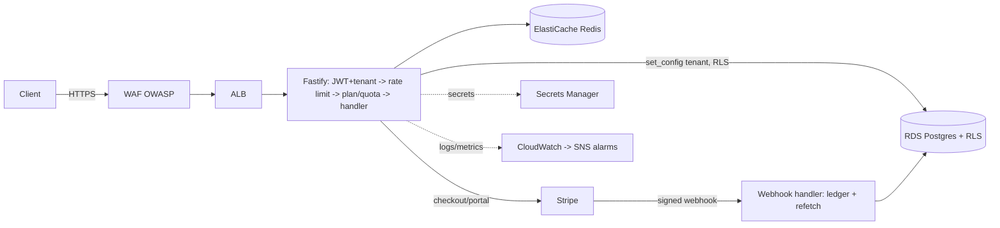

# TenantForge

A production-grade **multi-tenant SaaS API platform**. Organizations sign up, subscribe via
Stripe, and use a versioned REST API — with tenant isolation enforced at the database layer by
**PostgreSQL Row-Level Security** (verified by an automated zero-leakage test suite), per-tenant
Redis rate limiting, JWT auth with refresh-token rotation, and full AWS + Terraform + CI/CD
automation.

> Built to the spec in [`.kiro/specs/tenantforge`](./.kiro/specs/tenantforge) —
> [requirements](./.kiro/specs/tenantforge/requirements.md) ·
> [design](./.kiro/specs/tenantforge/design.md) · [tasks](./.kiro/specs/tenantforge/tasks.md).

## Highlights (hiring signals)

- **Provable tenant isolation** — Postgres RLS (`FORCE`) on a non-`BYPASSRLS` app role; a
  forgotten `WHERE` or raw SQL still can't cross tenants. Proven by a 3-tenant suite covering API,
  ORM, raw SQL, and write attempts → zero leakage. ([ADR-001](./docs/adr/ADR-001-tenant-isolation.md))
- **Idempotent Stripe billing** — signature-verified webhooks, insert-before-process ledger, and
  API-refetch state sync; redelivery is a safe no-op. ([ADR-004](./docs/adr/ADR-004-billing-idempotency.md))
- **Distributed rate limiting** — atomic Redis token-bucket (Lua) that holds across all Fargate
  tasks; standard `RateLimit` headers. ([ADR-003](./docs/adr/ADR-003-rate-limiting.md))
- **Auth** — short access JWT + rotating refresh tokens with family-based reuse detection.
  ([ADR-002](./docs/adr/ADR-002-auth-design.md))
- **API evolution** — `/v1` frozen; `/v2` ships a breaking change; both served concurrently.
- **DevOps** — Terraform (remote state, no-NAT VPC endpoints), GitHub Actions CI/CD with
  migrations-with-rollback and a staging→prod gate, WAF (OWASP), CloudWatch alarms → SNS.

## Architecture



## Tech stack

TypeScript · Fastify · Zod · Drizzle ORM · PostgreSQL (RDS) · Redis (ElastiCache) · Stripe ·
ECS Fargate · Terraform · GitHub Actions · WAF · CloudWatch · Docker · Vitest + Testcontainers.

## Local development

```bash
npm ci
docker run -d -p 5432:5432 -e POSTGRES_PASSWORD=owner_pw -e POSTGRES_USER=tenantforge_migrator -e POSTGRES_DB=tenantforge postgres:16-alpine
docker run -d -p 6379:6379 redis:7-alpine
cp .env.example .env   # fill DATABASE_URL / MIGRATION_DATABASE_URL / JWT_SIGNING_SECRET
npm run db:migrate     # tables + roles + RLS
npm run dev            # http://localhost:3000/health
```

## Testing

```bash
npm test          # unit + integration (Testcontainers spins up Postgres/Redis); runs sequentially
npm run rls-lint  # fails if any tenant-scoped table lacks an RLS policy
npm run typecheck && npm run lint
```

The cross-tenant isolation suite (`tests/integration/isolation.test.ts`) is the signature
deliverable. Load testing lives in [`k6/`](./k6/README.md).

## Infrastructure & deployment

Terraform modules in [`infra/`](./infra); each environment (`dev`/`staging`/`prod`) is a thin
wrapper over the shared `modules/stack`. CI (`.github/workflows/ci.yml`) lints, tests, builds, and
pushes to ECR; CD (`cd.yml`) applies Terraform, runs migrations with a rollback path, deploys to
ECS, smoke-tests, and gates prod behind staging. See the
[deployment & rollback runbook](./infra/RUNBOOK.md).

> **Status:** application verified end-to-end against real Postgres + Redis. IaC and pipelines are
> written and `terraform validate`-clean but **not yet applied to AWS** (requires account
> credentials + running the `infra/bootstrap` state stack first).

## Cost (~$10–15/month while running)

| Component | Instance | ~Monthly |
|---|---|---|
| RDS PostgreSQL | `db.t4g.micro` | ~$13 |
| ElastiCache Redis | `cache.t4g.micro` | ~$12 |
| ECS Fargate | 0.25 vCPU / 0.5 GB, 1 task | ~$9 |
| ALB | 1 | ~$16 (prorated; teardown between demos) |
| **NAT Gateway** | **avoided** (VPC endpoints) | **$0** (saves ~$32) |

Keep near the target by using the smallest instances and **tearing down between demo sessions**:

```bash
terraform -chdir=infra/envs/dev destroy
```

Retain only the repo, diagrams, committed OpenAPI spec, and a recorded demo. The pre-migration RDS
snapshot persists for later restore.

## Case-study asset checklist

- [ ] Screenshot: isolation suite passing (cross-tenant attempts → 0 rows / rejected writes).
- [ ] Screenshot: Stripe test-mode subscription + webhook log showing idempotent (duplicate) handling.
- [ ] Screenshot: `429` response with `Retry-After` + `X-RateLimit-*` under k6 load.
- [ ] Screenshot: CloudWatch dashboard (error rate, p99, 429 rate) + an alarm firing to SNS.
- [ ] k6 summary table (throughput, p99 read/write) recorded in [`k6/README.md`](./k6/README.md).
- [ ] Short demo video of the signup → subscribe → CRUD → rate-limit flow.

## Decisions

[ADR-001 tenant isolation](./docs/adr/ADR-001-tenant-isolation.md) ·
[ADR-002 auth](./docs/adr/ADR-002-auth-design.md) ·
[ADR-003 rate limiting](./docs/adr/ADR-003-rate-limiting.md) ·
[ADR-004 billing idempotency](./docs/adr/ADR-004-billing-idempotency.md)
